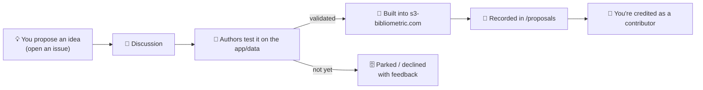

# S3 — Semantic Similarity Score

**A content-based method for science mapping — and an open hub for community-proposed analyses
built on top of it.**

S3 maps the intellectual structure of a research field from *what papers say* rather than *who
cites whom*, using transformer (SBERT) embeddings of titles and abstracts, a time-masking step,
and community detection. Citation data is re-introduced only to characterise and validate the
resulting communities. (Full method in [`docs/method.md`](docs/method.md).)

- 📄 **Paper:** *"Semantic Similarity Score: A New Method for Mapping Intellectual Structures in
  Business Research"* (Journal of Business Research, in press). See [`CITATION.cff`](CITATION.cff).
- 🌐 **App (no code needed):** **[s3-bibliometric.com](https://s3-bibliometric.com/)** — upload a
  Scopus / Web of Science / Dimensions / OpenAlex export and get the map.

---

## 💡 The point of this repository: propose new analyses

The S3 app already maps communities and computes citation-based metrics. But there are **many other
ways to analyse the same data** — for example, looking at **funding**, author **collaboration**,
**geography**, **temporal trends**, or **research impact** across the communities S3 finds.

This repository is where the community proposes those ideas. The workflow is simple:



1. **You have an idea** for a new analysis → open a **[💡 Analysis idea](../../issues/new/choose)**
   issue (there's a guided form).
2. The community and authors **discuss** feasibility.
3. The **authors prototype and test it on the app** and the underlying data.
4. If it works, it gets **implemented in the app** so everyone can use it, and the idea is recorded
   in [`proposals/`](proposals/README.md).
5. **You are added as a contributor** — in [`CONTRIBUTORS.md`](CONTRIBUTORS.md) and in the repo's
   contributor history.

See [`docs/proposal-process.md`](docs/proposal-process.md) for the full lifecycle, review criteria,
and exactly how crediting works, and browse [`proposals/`](proposals/README.md) for the current list
of ideas and their status.

> Not every idea will make it into the app — but every serious proposal gets a fair review and
> concrete feedback, and the discussion itself is valuable to the community.

---

## 🧭 What S3 already does (so you can build on it)

A six-step workflow (detail in [`docs/method.md`](docs/method.md)):

1. **Embeddings** — encode each title + abstract with `sentence-transformers/all-mpnet-base-v2`.
2. **S3 matrix + time-masking** — cosine similarity, then orient edges by publication date
   (parameter `γ` optionally blends in citations; `γ = 0` is pure semantics).
3. **Community detection** — threshold the graph, partition with **Leiden**, keep the top-*N*
   *Conceptual Building Blocks* (elbow/scree).
4. **Topic characterisation** — label communities from distinctive terms (c-TF-IDF, optional LLM).
5. **Citation analysis** — Quality Index (QI), Maturity Index (MI), local/global citations.
6. **Intellectual structure** — the validated field map.

Metric definitions are in [`docs/metrics.md`](docs/metrics.md); the data S3 consumes (and therefore
what a new analysis can draw on) is described in [`docs/data-format.md`](docs/data-format.md).

---

## 📂 Repository structure

```
.
├── README.md                  ← you are here
├── proposals/                 ← 💡 the catalogue of analysis ideas + their status  (start here)
│   ├── README.md              ← index, status legend, how to submit
│   ├── TEMPLATE.md            ← proposal template
│   └── examples/              ← worked example proposals (funding, geography)
├── docs/
│   ├── proposal-process.md    ← the full submit → test → implement → credit lifecycle
│   ├── method.md              ← how the S3 method works
│   ├── metrics.md             ← QI, MI, TCI, Silhouette, citation definitions
│   └── data-format.md         ← input data and where to get it
├── CONTRIBUTORS.md            ← 🎉 people credited for accepted ideas/contributions
├── examples/                  ← implemented analyses (notebooks / outputs)
├── src/                       ← method / app source code (if/when opened)
├── CONTRIBUTING.md            ← how to contribute (read before submitting)
├── CODE_OF_CONDUCT.md
├── CITATION.cff
├── LICENSE                    ← MIT
└── requirements.txt
```

---

## 🤝 Contributing & credit

The main way to contribute is to **propose an analysis** (above). You can also improve the method,
harden the code, or fix docs — see [`CONTRIBUTING.md`](CONTRIBUTING.md). Everyone whose proposal is
accepted, or who contributes code/docs, is credited in [`CONTRIBUTORS.md`](CONTRIBUTORS.md). Please
be respectful — see the [Code of Conduct](CODE_OF_CONDUCT.md).

## 📣 Citation & 📜 License

Cite the paper (see [`CITATION.cff`](CITATION.cff); update the DOI once published). Released under
the [MIT License](LICENSE).

## 🙏 Acknowledgements

Created by Hamid Bekamiri and co-authors. The app was built with substantial AI-assisted ("vibe")
coding; community ideas and contributions to extend and strengthen it are warmly welcomed.
